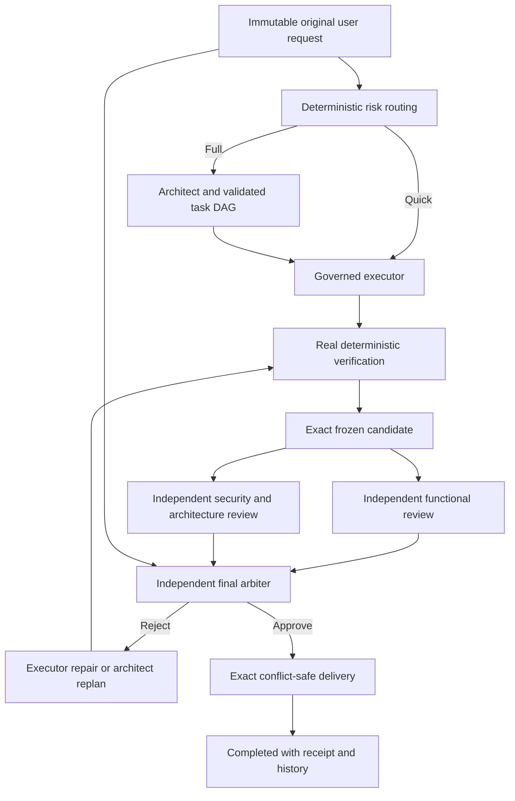

# Cycle for OpenCode User Manual

Cycle for OpenCode is a native OpenCode integration for evidence-gated software delivery. It adds one primary `Cycle` agent and five isolated roles without replacing OpenCode's existing Plan or Build agents. It has no separate dashboard, account, cloud service, or standalone user interface.

This manual is written for both first-time coding-agent users and experienced engineering teams. It explains what the integration does, when to use each mode, how to consult one role without starting implementation, how Goal Mode coordinates large products, and how to inspect or recover every workflow.

> Version 1.0.0 remains a release candidate until every native platform certification and release provenance gate passes. Follow the installation instructions from the published release, not an unverified archive.

## 1. Why Cycle for OpenCode Exists

OpenCode, Codex, Claude Code, and similar coding agents can be highly capable. A common risk is architectural rather than model-specific: one session interprets the request, writes the code, reviews its own assumptions, and then decides that the result is complete. Planning, implementation, and approval share the same context and blind spots.

That pattern can produce changes that look complete while leaving an adjacent layer unfinished. Typical examples include:

- a backend endpoint without the required frontend flow;
- a database migration that was generated but never executed against a real database;
- a UI that renders but does not complete the user journey;
- tests that cover a mock while the production integration remains broken;
- a security control implemented in one path but bypassed in another;
- a package that passes source tests but cannot be installed or started;
- a plan summary that quietly narrows the user's original request.

Cycle for OpenCode changes the delivery structure:

1. It preserves the exact original user request.
2. It separates architecture, execution, functional review, security review, and final arbitration.
3. It runs the project's real verification tools and records exact evidence.
4. It freezes the candidate before independent review.
5. It allows only the independent arbiter to approve the candidate.
6. It promotes the exact approved bytes and verifies them again after delivery.

This does not make software automatically correct. It makes missing evidence, self-approval, requirement drift, incomplete cross-layer work, and delivery conflicts materially harder to hide.

## 2. Native OpenCode Integration

Cycle for OpenCode uses OpenCode's native agents, tools, permission prompts, provider authentication, configuration, and project conversation. Select `Cycle` in the same agent selector used for other OpenCode agents.

The integration consists of:

- a TypeScript plugin loaded by OpenCode;
- a local per-user control plane managed automatically by the plugin;
- native OpenCode child sessions for isolated roles;
- local SQLite state, project history, project memory, and code intelligence;
- managed Git worktrees for governed implementation;
- an optional isolated browser for real UI verification.

Users do not start the control plane manually. Durable data is stored outside the OpenCode installation so application updates cannot overwrite workflow state or project changes.

## 3. The Core Workflow



The arbiter receives the original request directly. It does not receive only the architect's interpretation. User clarifications are stored as separate immutable amendments.

## 4. Requirements

- A certified OpenCode Desktop version listed in the release notes.
- Git for projects that require implementation and atomic delivery.
- At least 2 GiB of free disk space.
- At least 1 GiB of available memory beyond the project's own tools.
- At least one model provider configured in OpenCode.
- Stable Chrome, Edge, or Chromium when browser QA is required.
- The project's real build, test, database, and verification tools when those gates apply.

Cycle for OpenCode never reads or stores provider API keys. Provider authentication remains owned by OpenCode.

## 5. Installation

After a certified release is published, add the plugin to a user or project `opencode.json`:

```json
{
  "$schema": "https://opencode.ai/config.json",
  "plugin": ["opencode-cycle"]
}
```

Restart OpenCode Desktop, open the project, select `Cycle`, and run:

```text
/cycle setup
/cycle doctor
```

`setup` inspects non-secret provider and model metadata. `doctor` checks compatibility, the local database, project history, resources, and the native protocol.

Do not copy files into the OpenCode application directory. Do not launch `workflowd` manually.

## 6. Your First Ten Minutes

### 6.1 Discuss a change without implementing it

Select `Cycle` and write:

```text
Ask the architect to explain the safest way to add organization-level billing to this project. Do not implement anything.
```

The architect can inspect the repository with read-only tools and continue the discussion across several messages. No executor, reviewer, or arbiter delivery cycle starts.

### 6.2 Inspect your setup

```text
/cycle setup
/cycle models
/cycle permissions
/cycle limits
```

### 6.3 Run a small implementation

First arm Quick mode:

```text
/cycle run quick
```

Then send the exact request as a separate message:

```text
Fix the incorrect empty-state message on the invoices page and add the regression test.
```

### 6.4 Run an important cross-layer implementation

```text
/cycle run full
```

Then send:

```text
Implement organization invitations end to end, including database constraints, API authorization, email retry behavior, the frontend acceptance flow, browser verification, and production packaging checks.
```

### 6.5 Follow progress

```text
/cycle status
/cycle tasks
/cycle evidence
```

The background orchestrator advances independently. Repeated status polling is unnecessary.

## 7. Workflow Modes

### Auto

Auto is the normal default. Deterministic facts choose the least expensive safe route. Narrow, low-risk changes may use Quick mode. Security-sensitive, ambiguous, cross-layer, migration, packaging, or high-impact work is promoted to Full mode.

Use:

```text
/cycle run auto
```

### Quick

Quick is for bounded low-risk implementation. It still requires governed execution, deterministic verification, a frozen candidate, independent arbitration, and exact delivery. It is not an unreviewed direct-edit mode.

Use:

```text
/cycle run quick
```

Critical work cannot be silently downgraded to Quick mode.

### Full

Full runs architecture, bounded task decomposition, execution, deterministic verification, two independent reviews, final arbitration, repair when required, and exact delivery.

Use:

```text
/cycle run full
```

Choose Full for authentication, authorization, payments, migrations, infrastructure, public APIs, multi-layer features, major refactors, production incidents, or requests with material ambiguity.

### When not to start a workflow

Do not spend a Full cycle on a question, explanation, design discussion, code tour, feasibility estimate, or plan review. Use a standalone role consultation instead.

## 8. Roles and Independence

`Cycle` creates five isolated child agents: `Cycle Architect`, `Cycle Executor`, `Cycle Functional Reviewer`, `Cycle Security and Architecture Reviewer`, and `Cycle Arbiter`.

### Cycle entrypoint

`Cycle` is the user-facing primary agent. It captures the exact request, chooses native operations, reports state, and coordinates the governed roles. It cannot replace independent approval with its own opinion.

### Architect

The architect receives the exact request and bounded read-only repository context. It produces a requirement matrix, acceptance criteria, risks, verification requirements, and an acyclic task plan with bounded ownership.

It cannot edit files, implement the plan, or approve a candidate.

Standalone example:

```text
Ask the architect to compare a modular monolith and services for this SaaS. Keep the session read-only and identify decision triggers rather than implementing either design.
```

### Executor

The executor implements one authorized bounded task inside a managed worktree. It may use terminal commands, CLIs, MCP servers, skills, plugins, databases, and the managed browser when OpenCode's effective permissions allow them.

It cannot approve its own work. Outside a governed workflow it is restricted to read-only feasibility analysis.

Standalone example:

```text
Ask the executor for a read-only feasibility assessment of this migration, including the exact commands and environments that a governed workflow would need.
```

### Functional reviewer

The functional reviewer checks the frozen candidate against the original request and raw evidence. It looks for incomplete behavior across frontend, backend, database, integrations, packaging, and user-visible flows.

It cannot edit files and does not see the security review before submitting its own verdict.

Standalone example:

```text
Ask the functional reviewer to challenge this implementation plan for missing end-to-end behavior. Do not start implementation.
```

### Security and architecture reviewer

This reviewer checks trust boundaries, authorization, input validation, dependencies, architecture compatibility, maintainability, resource behavior, and production risk.

It cannot edit files and does not see the functional review before finalizing.

Standalone example:

```text
Ask the security reviewer to threat-model this upload design and list blocking findings separately from recommendations.
```

### Independent arbiter

The arbiter receives the immutable request, amendments, exact candidate, mandatory evidence, and both finalized reviews. It approves only when every requirement and mandatory gate is satisfied. Otherwise it requests executor repair or architect replanning.

A standalone arbiter can assess readiness but cannot approve a release candidate.

Standalone example:

```text
Ask the arbiter whether the current goal plan is ready for implementation. Treat the result as advisory readiness, not final delivery approval.
```

## 9. What Happens During a Full Workflow

1. **Intake** preserves the exact user message and attachment digests.
2. **Routing** records deterministic risk facts and the selected mode.
3. **Code intelligence** retrieves bounded repository context from the incremental local graph.
4. **Architecture** validates requirement coverage and creates the task DAG.
5. **Scheduling** admits work only when CPU, memory, disk, and global concurrency reserves are safe.
6. **Execution** assigns one bounded task and authorized write scope at a time.
7. **Verification** runs applicable real build, test, lint, database, browser, security, and packaging commands.
8. **Freeze** stores the exact diff, file bytes, executable modes, digests, and evidence identifiers.
9. **Independent review** runs the functional and security reviews in isolated sessions.
10. **Arbitration** compares the exact request with the candidate and evidence.
11. **Repair** returns the candidate to the executor or architect when rejected, up to the configured five-cycle limit.
12. **Delivery** verifies the source preimage, preserves concurrent changes, promotes exact approved bytes, verifies them, and writes the completion receipt.

## 10. Complete Command Reference

Commands are entered in the `Cycle` conversation. Destructive or export operations require `--confirm` after explicit user approval.

| Command | Purpose | Example or important behavior |
| --- | --- | --- |
| `/cycle setup` | Inspect compatibility, providers, models, and role assignments | Run after installation or provider changes |
| `/cycle run [auto|quick|full]` | Arm the next exact non-command request | `/cycle run full` |
| `/cycle status` | Show state, mode, candidate, and repair budget | Read-only |
| `/cycle tasks` | Show durable task identifiers, ownership, dependencies, attempts, and states | Read-only |
| `/cycle evidence` | Show candidate gate records without raw secret-bearing output | Read-only and redacted |
| `/cycle models [role] [provider/model]` | Inspect models or set one until OpenCode restarts | `/cycle models executor zai-coding-plan/glm-5.3` |
| `/cycle permissions` | Show the permission preset and immutable role boundaries | Read-only |
| `/cycle limits` | Show adaptive admission, resource reserves, and repair limits | Read-only |
| `/cycle pause` | Pause at the next safe boundary | Verification and delivery remain atomic |
| `/cycle resume` | Reconcile and resume the exact saved phase | Rejects a workflow that is not paused |
| `/cycle cancel` | Cancel the latest authorized workflow | Requires `/cycle cancel --confirm` |
| `/cycle retry` | Retry a classified transient or blocked failure | Infrastructure retries do not consume repair cycles |
| `/cycle history` | Query redacted project audit events | Paginated read-only result |
| `/cycle history verify` | Verify the hash chain and signed checkpoints | Run after restores or important updates |
| `/cycle memory search` | Search bounded reusable project knowledge | Add search text after the command |
| `/cycle memory explain` | Load one selected memory entry and provenance | Add the memory identifier |
| `/cycle memory remove` | Revoke an eligible memory entry | Add the identifier and `--confirm` |
| `/cycle doctor` | Run read-only database, ledger, resource, and protocol diagnostics | Run before recovering important work |
| `/cycle export` | Export redacted history and public verification material | Requires `/cycle export --confirm` |
| `/cycle help` | Render the runtime-owned command list | Safe first command |

### Command examples

```text
/cycle models
/cycle models architect provider/model
/cycle memory search authentication decision
/cycle memory explain 018f-example-memory-id
/cycle memory remove 018f-example-memory-id --confirm
/cycle cancel --confirm
/cycle export --confirm
```

`/cycle run` arms the next request. The command itself is not the implementation request. This separation prevents generated command text from replacing the user's exact message.

## 11. Goal Mode

A goal is a durable multi-milestone outcome. It is not a long-running model session and it does not automatically execute every milestone. Each implementation milestone remains a separately reviewed workflow.

Use Goal Mode for a SaaS, product, migration program, platform rewrite, or any outcome that needs several independently deliverable stages.

### Goal states

`draft`, `planning`, `ready`, `active`, `paused`, `blocked`, `completing`, `completed`, and `aborted`.

### Recommended Goal Mode sequence

1. Ask Cycle to create a goal from your exact message and provide explicit success criteria.
2. Discuss requirements with the architect across as many read-only turns as needed.
3. Save the reviewed plan as an immutable plan revision.
4. Ask both reviewers to challenge the plan independently.
5. Ask the arbiter for advisory readiness.
6. Mark the goal ready and activate it through OpenCode's native approval.
7. Run one bounded milestone workflow at a time.
8. Link every workflow to its goal and milestone.
9. Request completion only when every linked workflow is completed.
10. Approve completion using evidence from all linked workflows.

### Beginner example

```text
Create a goal for delivering a multi-tenant invoicing SaaS. Success requires tenant isolation, subscription billing, invoice generation, audit history, an accessible web interface, tested backup and restore, and production deployment documentation. Do not implement yet.
```

Then continue:

```text
Ask the architect to identify bounded milestones, non-goals, trust boundaries, data ownership, and the verification required for each milestone.
```

After the plan is reviewed and activated:

```text
Run the tenant identity and isolation milestone in full mode and link it to the active goal.
```

The original objective is never replaced by the architect's summary. Later requirements are appended as amendments.

### Continuation limit

The default goal continuation limit is five. A sixth continuation is rejected unless an owner-authorized policy explicitly changes the governing limit. This prevents an unlimited autonomous loop from silently consuming budget.

## 12. Automatic Role Operations

Users normally request these operations in plain English. Their names are documented for transcript audits and expert troubleshooting.

| Operation | Role | Behavior |
| --- | --- | --- |
| `architect_consult` | Architect | Multi-turn read-only requirements and design consultation |
| `executor_feasibility` | Executor | Read-only feasibility, scope, command, and verification analysis |
| `functional_review` | Functional reviewer | Advisory end-to-end completeness review |
| `security_review` | Security reviewer | Advisory security, architecture, dependency, and resource review |
| `arbiter_readiness` | Arbiter | Advisory readiness check against the exact request, goal, and plan |

Standalone operations never edit the project and cannot issue final candidate approval. Each result includes the isolated role session identifier and the exact configured provider/model passed to OpenCode; `null` means OpenCode inherited the active session model.

## 13. Automatic Goal Operations

| Operation | Purpose |
| --- | --- |
| `goal_create` | Create and focus a goal from the exact current request |
| `goal_amend` | Append the exact current request as an immutable amendment |
| `goal_status` | Return a named or focused goal, latest plan, and linked workflows |
| `goal_list` | List goals owned by the current project |
| `goal_focus` | Focus one project-owned goal in the current session |
| `goal_save_plan` | Save a new immutable plan revision |
| `goal_link_workflow` | Link a same-project workflow to a milestone |
| `goal_transition` | Apply one idempotent lifecycle transition |

Supported transition values are:

- `start_planning`
- `mark_ready`
- `activate`
- `pause`
- `resume`
- `block`
- `resume_blocked`
- `continue`
- `request_completion`
- `approve_completion`
- `reject_completion`
- `abort`

Goal creation, readiness, activation, completion approval, and abort use native OpenCode approvals where required. Completion cannot pass while a linked workflow is incomplete. Call `request_completion` without `completionEvidence`; provide the lowercase SHA-256 evidence digest only with `approve_completion`.

## 14. Managed Browser QA

Browser QA is a native governed tool, not a separate browser application. It launches an isolated temporary Chrome, Edge, or Chromium profile. It never imports the user's normal cookies, passwords, extensions, or history.

### Browser operations

| Operation | Purpose and boundary |
| --- | --- |
| `open` | Open a loopback or approved HTTP/HTTPS origin |
| `snapshot` | Return a bounded accessibility snapshot, title, and safe URL |
| `click` | Click a semantic or CSS target; governed executor only |
| `fill` | Fill a literal test value or environment-backed secret without echoing it; executor only |
| `press` | Send a key, optionally to a target; executor only |
| `upload` | Upload a project-contained file; executor only |
| `check` | Assert visibility, text, or URL deterministically |
| `screenshot` | Store a PNG outside the repository and return its digest |
| `logs` | Return bounded console, page-error, and failed-request records |
| `close` | Close the browser, write the receipt, and delete the temporary profile |

### UI workflow example

```text
Implement the password-reset flow in full mode. Start the real local application, use a disposable test account, verify the request and completion pages in the managed browser, assert the success state, inspect browser errors and failed requests, and capture screenshot evidence. Do not use my normal browser profile.
```

Loopback origins are allowed by default. External origins require a native approval unless configured in `browserAllowedOrigins`. URL credentials and non-web schemes are rejected.

## 15. Terminal, CLI, MCP, Skills, Plugins, and Databases

The governed executor can use the capabilities already available through OpenCode when its effective policy permits them:

- shell and terminal commands;
- language and package-manager CLIs;
- Git and project scripts;
- MCP servers;
- installed skills and plugins;
- local containers and databases;
- managed browser automation;
- build, test, lint, typecheck, security, and packaging tools.

The architect, reviewers, and arbiter remain read-only. Directly opening a hidden role does not grant executor permissions. Unmanaged subagent delegation is denied for every role.

Destructive operations, publishing, deployment, credential changes, production mutations, and external data movement remain subject to explicit user intent and OpenCode's native approvals.

### Database example

```text
Implement this schema migration in full mode. Apply it to an isolated real database, run the forward and rollback checks, exercise the affected repository queries, verify constraints with representative data, and record the exact commands and results. A generated migration file alone is not sufficient evidence.
```

## 16. Project History

Cycle for OpenCode records who performed an action, when it occurred, the role and model identity, supplied context digests, tool action digests, state transitions, evidence identities, reviews, arbitration, and delivery receipts.

Use:

```text
/cycle history
/cycle history verify
```

The ledger is hash chained and includes signed checkpoints. Secrets, raw credentials, and private signing material are not exported. Verification proves consistency relative to the local installation key; it is not an external transparency service against an administrator who controls both data and keys.

## 17. Project Memory

Memory stores reusable local project knowledge separately from history and code intelligence. Entries include scope, provenance, confidence, evidence links, author, and state.

Confidence classes are `verified`, `user_asserted`, and `inferred`. Model inference cannot become verified merely because a model repeated it.

Use:

```text
/cycle memory search billing boundary
/cycle memory explain MEMORY_ID
/cycle memory remove MEMORY_ID --confirm
```

Memory uses local SQLite FTS5. It does not require a cloud vector database.

## 18. Incremental Code Intelligence

Code intelligence is mandatory and local. The first scan inventories supported files, respects Git-compatible ignore rules, rejects symlink escapes, hashes content, parses supported languages, and stores an evidence-backed graph in SQLite.

Later workflows reuse unchanged partitions. Changed, renamed, and deleted files update only affected graph data. This avoids repeatedly loading or sending a large codebase to every model.

Context queries are bounded by bytes, items, nodes, edges, and traversal depth. Truncation is reported rather than hidden.

## 19. Resource Management and Concurrent Projects

One per-user control plane governs all OpenCode projects. It can persist and schedule more than 100 workflows without promising 100 simultaneous models, browsers, builds, or databases.

The active-workflow ceiling is derived from logical CPUs and clamped from one to eight. Admission pauses when:

- CPU exceeds 85%;
- the memory reserve would fall below 1 GiB;
- the disk reserve would fall below 2 GiB;
- another admitted operation owns a required global resource.

Projects use round-robin fairness. Verification has priority over indexing. Recovery admits work gradually to avoid a restart stampede.

Inspect the live policy with:

```text
/cycle limits
```

## 20. Model Configuration

Cycle for OpenCode is model-independent. Effective role-model precedence is: a runtime `/cycle models <role> <provider/model>` override until restart, an explicit plugin role option, a valid `model` configured on that native Cycle role agent, then the model active when intake starts. Invalid or non-string native role model values are ignored and removed from the registered native role agent. All roles retain separate sessions and permissions. `/cycle models` reports the effective direct assignments, named variants and a safe subset of effective reasoning controls without exposing provider credentials or unrelated options.

Persistent plugin-level assignments use OpenCode `provider/model` identifiers:

```json
{
  "plugin": [
    [
      "opencode-cycle",
      {
        "architectModel": "provider-a/model-a",
        "executorModel": "provider-b/model-b",
        "functionalReviewerModel": "provider-c/model-c",
        "securityReviewerModel": "provider-d/model-d",
        "arbiterModel": "provider-e/model-e",
        "permissionPreset": "balanced"
      }
    ]
  ]
}
```

Process-scoped changes use:

```text
/cycle models executor zai-coding-plan/glm-5.3
```

Provider-specific reasoning can be configured directly on a native role agent:

```json
{
  "$schema": "https://opencode.ai/config.json",
  "agent": {
    "Cycle Executor": {
      "model": "zai-coding-plan/glm-5.3",
      "reasoningEffort": "max"
    }
  }
}
```

An OpenCode named variant is a catalog overlay and is configured separately when the selected model exposes that exact variant:

```json
{
  "agent": {
    "Cycle Arbiter": {
      "model": "openai/gpt-5.6-sol",
      "variant": "xhigh"
    }
  }
}
```

Do not assume that a direct `reasoningEffort` value and a named `variant` are interchangeable. `/cycle models` reports both independently.

Use `opencode models <provider> --refresh --verbose` or OpenCode's model selector to confirm current identifiers and variants. Model availability changes independently of the plugin.

### Example heterogeneous profile

The following is an example, not a product default or a permanent ranking:

| Role | Example assignment | Reason for placement |
| --- | --- | --- |
| Architect | A strong long-context planning model | Requirement decomposition and system tradeoffs |
| Executor | `zai-coding-plan/glm-5.3` with `max` effort | Agentic coding, tool use, and long implementation context |
| Functional reviewer | An independent non-GLM model family | Finds completeness defects without sharing executor assumptions |
| Security reviewer | A separate security-capable model family | Preserves architectural and security diversity |
| Arbiter | A high-reliability independent model family | Final request-to-evidence comparison |

Do not move every role to a newly released model merely because it is newer. Diversity between executor, reviewers, and arbiter reduces correlated blind spots. Reevaluate roles only with stable provider support and representative repository tests.

## 21. Permission Presets

`permissionPreset` accepts `safe`, `balanced`, or `autonomous`.

| Preset | Behavior |
| --- | --- |
| `safe` | Tool use asks by default; external directories and loop-like behavior are denied |
| `balanced` | Retains OpenCode policy, denies external directories, and asks for loop-like behavior |
| `autonomous` | Retains OpenCode policy up to immutable role boundaries |

No preset can elevate a permission that OpenCode denied or requires approval for. `autonomous` does not permit reviewers to edit files, bypass confirmations, publish artifacts, or access credentials.

Inspect the effective policy with:

```text
/cycle permissions
```

## 22. Failure and Recovery

| Symptom | Meaning | Correct response |
| --- | --- | --- |
| `safe mode` | Required host capability missing, Desktop below 1.18.16, or a major version other than 1 | Restore OpenCode 1.x at or above 1.18.16 and run `doctor`. Newer 1.x updates are compatible warnings, not safe mode. On OpenCode 2.x and later the plugin API differs and a Cycle build targeting that major version is required. |
| `cpu_pressure`, `memory_pressure`, `disk_pressure` | A machine reserve would be violated | Free resources; the retry does not consume a repair cycle |
| `concurrency_limit` or `fair_queue` | Another workflow owns capacity | Wait for normal admission |
| `blocked` after rejection | Five candidate repair cycles were exhausted | Inspect request and evidence, amend deliberately, then retry |
| mandatory gate failed | Required build, test, database, browser, security, or packaging evidence failed | Fix the real failure; do not relabel it as skipped |
| candidate changed | Files changed after freeze | Discard stale reviews and freeze a new candidate |
| delivery conflict | Source state no longer matches the approved preimage | Preserve both states and reconcile through a new cycle |
| history verification failed | Ledger consistency cannot be proven | Stop, preserve data, restore a trusted backup, or report a security issue |

Useful commands:

```text
/cycle pause
/cycle resume
/cycle retry
/cycle doctor
/cycle history verify
```

`pause` takes effect only at a safe boundary. Verification and final delivery are atomic phases. `cancel --confirm` preserves history, evidence, and recoverable worktree state rather than pretending the work never happened.

## 23. Updates, Backups, and Removal

Before changing plugin versions, close OpenCode Desktop and copy the entire data directory. Version 1.0.0 certifies Windows x64 and Linux x64 on OpenCode Desktop 1.18.21; macOS x64 and macOS arm64 ship as compatible but untested, meaning their packages are published and resolvable and no Desktop certification evidence covers them. Supported installations keep the existing data-directory folder name so current installs are not moved:

| Platform | Data directory |
| --- | --- |
| Windows | `%LOCALAPPDATA%\OpenCode Cycle` |
| Linux | `${XDG_DATA_HOME:-~/.local/share}/opencode-cycle` |

After an update:

```text
/cycle doctor
/cycle history verify
```

To disable the plugin, remove `opencode-cycle` from the native `plugin` array and restart OpenCode. Project changes and durable data are preserved intentionally. Delete the data directory only after OpenCode is closed, a required backup exists, and no history, evidence, memory, or worktree is needed.

## 24. Daily Use Examples

### Small bug

```text
/cycle run auto
```

```text
Fix the duplicate validation message in the account form and add the narrow regression test.
```

### Cross-layer feature

```text
/cycle run full
```

```text
Add project archiving end to end. Include authorization, database state, API behavior, UI controls, browser verification, audit history, and backward-compatible restore behavior.
```

### Planning only

```text
Ask the architect to design the tenancy and billing boundaries for this SaaS. Continue the discussion until assumptions, non-goals, risks, and milestones are explicit. Do not implement.
```

### Independent plan challenge

```text
Ask the functional reviewer and security reviewer to challenge this plan independently. Do not show either reviewer the other's findings before both are final.
```

### Release readiness

```text
Ask the arbiter for an advisory readiness assessment against my original goal and the latest plan. List every missing gate. Do not treat this as candidate approval.
```

## 25. What It Improves Compared with a Traditional Single-Agent Session

The comparison below is about workflow structure, not a claim that another product or model is inherently defective.

| Concern | Traditional single-session use | Cycle for OpenCode |
| --- | --- | --- |
| Request fidelity | Depends on the active session's interpretation | Immutable original request plus separate amendments |
| Planning and implementation | Often share one context | Architect and executor are isolated roles |
| Self-review | The implementer may evaluate its own output | Executor cannot approve its candidate |
| Functional and security review | Optional or sequential in the same context | Two independent reviews finalized before arbitration |
| Verification | May rely on reported success | Exact project commands and captured evidence |
| Cross-layer completeness | Depends on one agent remembering every layer | Functional reviewer checks end-to-end coverage |
| Final approval | Often the active agent's completion claim | Independent arbiter compares request, candidate, evidence, and reviews |
| Delivery | Working-tree changes may drift after review | Frozen exact payload and conflict-safe promotion |
| Long product work | Conversation history becomes the plan | Durable goals, versioned plans, milestones, and linked workflows |
| Repository scale | Repeated broad context scans | Incremental local code graph and bounded retrieval |
| Auditability | Session transcript only | Durable project history, digests, checkpoints, and receipts |
| Resource control | Each session starts work independently | One fair resource-aware control plane across projects |

For daily enterprise development, this is valuable when the cost of an incomplete or falsely approved change is greater than the cost of independent review. It is intentionally unnecessary for many questions and tiny non-critical edits.

## 26. Cost and Performance Guidance

- Use consultation for discussion and planning.
- Use Auto for normal daily work.
- Use Quick for clearly bounded low-risk changes.
- Use Full for material production risk or cross-layer work.
- Use separate model families for the executor, reviewers, and arbiter when budget permits.
- Use maximum reasoning for the roles that handle the most consequential long-horizon decisions, not automatically for every small task.
- Keep real project verification deterministic so expensive models do not repeatedly debate facts a command can prove.

Full mode uses more tokens, model sessions, time, and local tools than a single-agent edit. That cost is the price of independent evidence and should be spent deliberately.

## 27. Security and Trust Limits

Cycle for OpenCode does not guarantee defect-free or secure software. Its assurance is limited by:

- the quality and independence of configured models;
- the actual tests and tools available in the project;
- the fidelity of test data and environments;
- provider availability and limits;
- the permissions granted by the user;
- the local machine-owner trust boundary.

Repository files, documentation, websites, terminal output, MCP results, test fixtures, and model output are treated as untrusted data. They cannot override user intent, role boundaries, or native permissions.

## 28. Daily Checklist

Before important work:

```text
/cycle doctor
/cycle setup
```

During work:

```text
/cycle status
/cycle tasks
/cycle evidence
```

After important delivery or an update:

```text
/cycle history verify
```

Use Full mode only when the risk justifies it, but never replace required evidence with a model's confidence.

## 29. Further Reference

- [Getting Started](guides/getting-started.md)
- [Command Reference](commands/reference.md)
- [Automatic Operation Reference](commands/automatic-operations.md)
- [Goals and Role Consultation](guides/goals-and-consultation.md)
- [Managed Browser QA](guides/managed-browser.md)
- [Expert Configuration](guides/expert-configuration.md)
- [Operations and Recovery](guides/operations-and-recovery.md)
- [Code Intelligence](guides/code-intelligence.md)
- [Threat Model](security/threat-model.md)
- [Release Verification](releases/verification.md)
